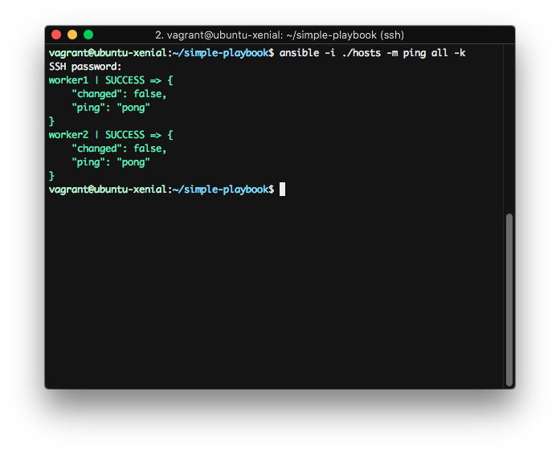
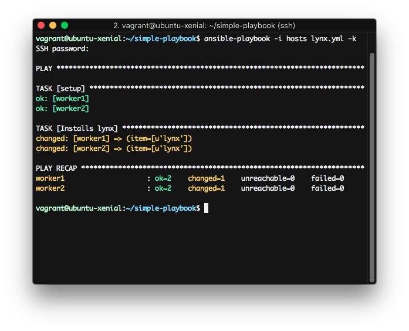
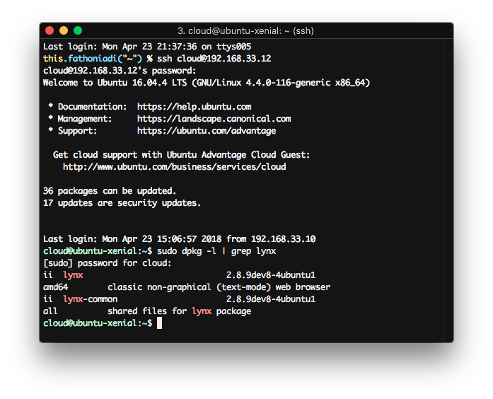
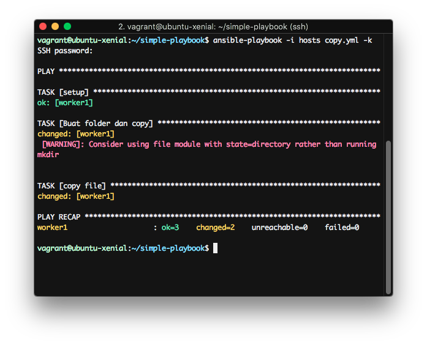
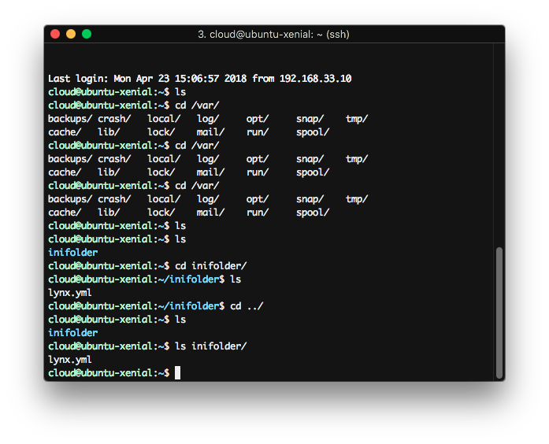

# Ansible

## A. Dasar Teori
### A.1. Ansible
Ansible adalah sebuah provisioning tool yang dikembangkan oleh RedHat. Dimana kamu dapat mencatat setiap proses deployment ataupun konfigurasi yang biasa dilakukan berulang - ulang terhadap beberapa server. Misal saat pertama kali kita memasang Ubuntu Server di 10 mesin, maka kita akan melakuan apt-get update serta memasang beberapa komponen seperti PHP5 dan Apache2. Sebenarnya tidak akan menjadi masalah, bila kita hanya melakukan sedikit hal. Tapi bayangkan bila harus melakukan konfigurasi yang cukup kompleks dan dilakukan secara berulang - ulang ke 10 mesin tersebut.

Sumber : [https://www.codepolitan.com/menggunakan-ansible-untuk-mengelola-server-yang-lebih-mudah-58e8e909d3861](https://www.codepolitan.com/menggunakan-ansible-untuk-mengelola-server-yang-lebih-mudah-58e8e909d3861)

## B. Instalalasi
### Ubuntu 16.04
1. Jalankan perintah

        sudo apt install ansible
        sudo apt-get install sshpass

## C. Getting Started
### C.1. Testing 123
1. Buat folder simple-playbook
2. Pindah ke folder simple-playbook dan buat file `hosts` sebagai vagrant inventory, dengan isi:

        worker1 ansible_host=[IP VM 1] ansible_ssh_user=cloud ansible_become_pass=raincloud123!
        
        worker2 ansible_host=[IP VM 2] ansible_ssh_user=cloud ansible_become_pass=raincloud123!

3. Kemudian jalankan perintah

        ansible -i ./hosts -m ping all -k

    

    Keterangan :
    1. parameter -i digunakan untuk digunakan untuk mendeclare ansible inventory.
    2. parameter -m digunakan untuk declare module command
    3. parameter -k digunakan untuk menanyakan password login ssh
    4. parameter all digunakan untuk penanda ansible dijalankan di host mana. Parameter all bisa diganti dengan nama host.

### C.2. Shell Command
1. Jalankan perintah

        ansible -i ./hosts -m shell -a 'uname -a' all -k

### C.3. Grouping Host
1. Buka file `hosts` dan tambahkan nama group. Contoh nama groupnya adalah worker

        [worker]
        worker1 ansible_host=192.168.33.11 ansible_ssh_user=cloud ansible_become_pass=raincloud123!
        worker2 ansible_host=192.168.33.12 ansible_ssh_user=cloud ansible_become_pass=raincloud123!

2. Buat file `lynx.yml` dengan isi sebagai berikut

         - hosts: worker
           tasks:
             - name: Install lynx
               become: yes #untuk menjadi superuser
               apt: name={{ item }} state=latest update_cache=true
               with_items:
                 - lynx

3. Jalankan perintah

        ansible-playbook -i hosts lynx.yml -k

4. Hasil

    

    
    

### C.4.  Copy File
1. Buat file copy.yml, dengan isi

        - hosts: worker
          tasks:
            - name: Buat folder dan copy
              command: mkdir -p inifolder
            - name: copy file
              copy: src=./lynx.yml dest=~/inifolder/lynx.yml

2. Jalankan dengan perintah

        ansible-playbook -i hosts copy.yml -k

    

    

## D. Sumber Lain
[https://github.com/leucos/ansible-tuto](https://github.com/leucos/ansible-tuto)

## E. Soal

1. Buat 3 VM, 2 Ubuntu 16.04 sebagai worker, 1 Debian 9 sebagai DB server
2. Pada vm Debian install Mysql dan setup agar koneksi DB bisa diremote dan memiliki user:
    username: regal
    password: bolaubi

3. Pada worker:
    2.1. Install Nginx
    2,2, Install PHP 7.2
    2.3. Install composer
    2.4. Install Git

    dan pastikan worker dapat menjalankan Laravel 5.6
    
4. Clone [https://github.com/udinIMM/Hackathon](https://github.com/udinIMM/Hackathon) pada setiap worker dan setup database pada .env mengarah ke DB server.

5. Setup root directory nginx ke folder Laravel hasil clone repo diatas
