# Docker

### Persyaratan Mengikuti Praktikum
		1. Sudah menginstall Ubuntu 16.04.
		2. Sudah menginstall Docker CE
		3. Sudah menginstall Docker Compose
		4. Pastikan komputer dapat connect ke Internet

## A. Dasar Teori
### 1. Perbedaan _Virtual Machine_ dengan Docker

### 2. Docker
Docker adalah virtualisasi berbentuk kontainer. Kontainer bekerja lebih efisien daripada virtual mesin, karena yang divirtualisasikan hanya aplikasi dan library yang dibutuhkan saja. Kontainer lebih hemat memory daripada virtual mesin. Untuk memulai menggunakan docker terlebih dahulu mesin docker harus terinstall harus terinstall pada komputer host.

## B. Instalasi

### 1. Instalasi Docker
- Instalasi pada [Ubuntu](https://docs.docker.com/install/linux/docker-ce/ubuntu/#install-docker-ce-1)
Keterangan : Lakukan instalasi sampai [Continue to Post-installation steps for Linux](https://docs.docker.com/install/linux/linux-postinstall/) bagian __Configure Docker to start on boot__

### 2. Instalasi Docker Composer
- Instalasi pada [Ubuntu](https://docs.docker.com/compose/install/#linux)

### C. Getting Started
#### C.1 Docker Hello World
Untuk mengecek apakah docker sudah terinstall dengan benar silahkan jalankan perintah

    docker run hello-world
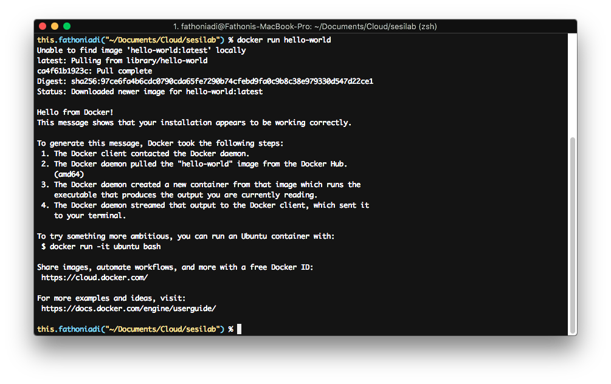

#### C.2 Menjalankan aplikasi apache2 sebagai kontainer
Kali ini kita akan menjalankan apache2 sebagai kontainer. Docker telah menyediakan banyak kontainer dengan macam-macam jenis aplikasi. Untuk melihat apakah apache2 terdapat pada database docker, jalankan perintah berikut.

    docker search apache2

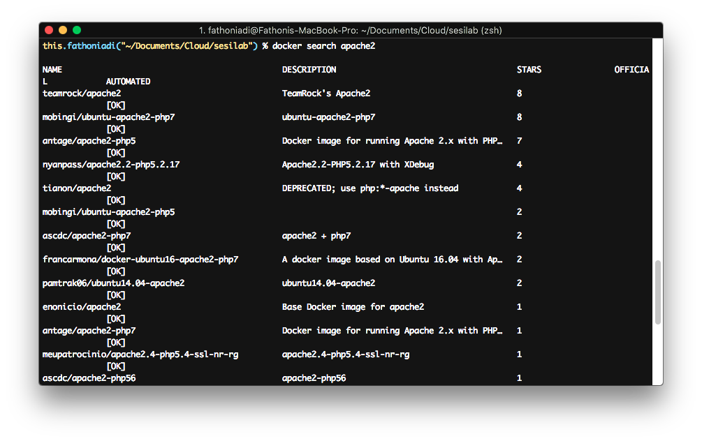

Pada contoh diatas bisa dilihat banyak image container yang disediakan oleh komunitas docker. Namun kita juga bisa mendownload image container resmi dari perusahaan pengembang. Apache2 memiliki nama lain __httpd__.

    docker search httpd

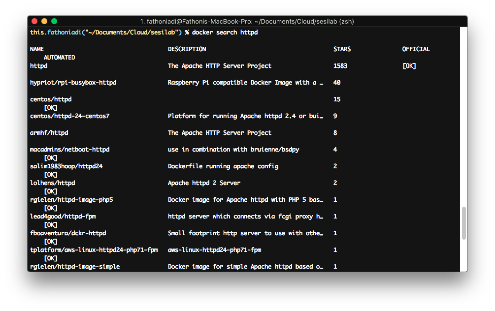

Terdapat hasil pencarian dengan Name httpd dan official ok, berarti kontainer/image tersebut adalah image resmi yang dikeluarkan oleh vendor. Untuk menjalankan kontainer apache2, ikuti langkah-langkah berikut:

1. Download image container

        docker pull httpd

2. Buat kontainer baru menggunakan base image httpd

        docker run --name apache-cloud -p 9000:80 -d httpd
    
    Keterangan :
    - perintah --name digunakan untuk memberikan nama pada kontainer yang akan dibuat.
    - perintah -p digunakan sebagai port forwarding 9000 adalah port pada host, sedangkan 80 adalah port pada kontainer (port forwarding).
    - perintah -d menandakan image kontainer dijalankan sebagai servis.
    - httpd adalah nama image yang digunakan untuk membuat kontainer.

    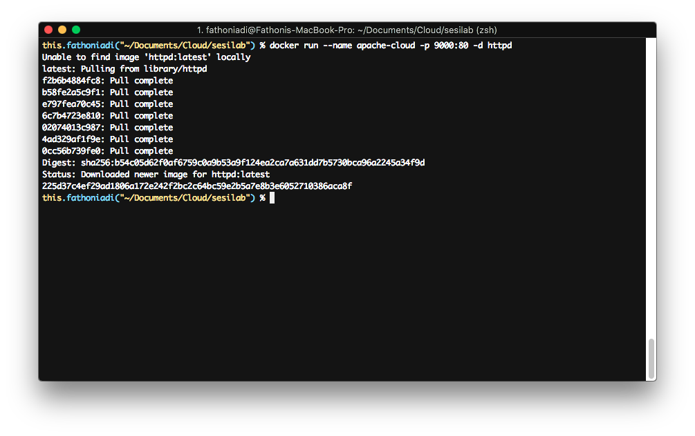

3. Setelah berhasil dibuat, jalankan perintah

    `docker ps`

    untuk melihat kontainer yang sedang aktif.

    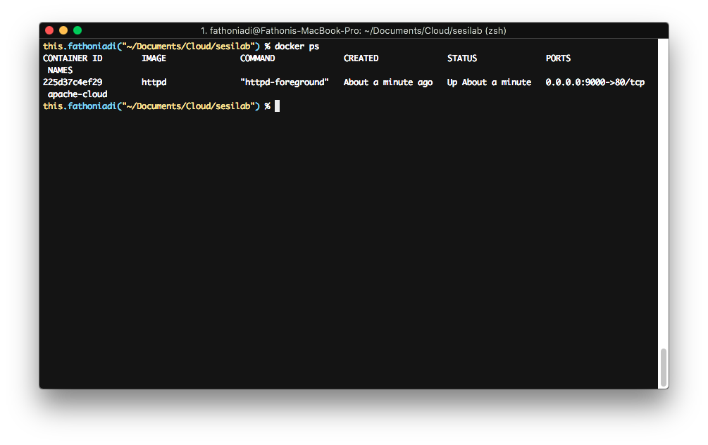

4. Cek pada browser

    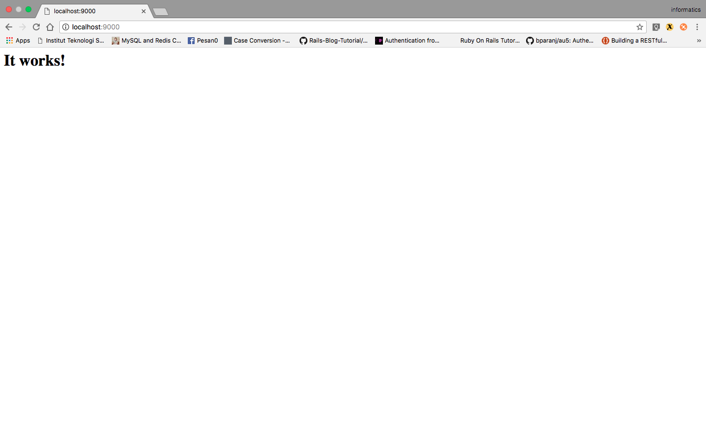

5. Beberapa command yang penting untuk diketahui
    - Untuk menghentikan container docker : `docker stop apache-cloud`
    - Untuk menyalankan kembali container docker : `docker start apache-cloud`
    - Untuk me-restart container docker : `docker restart apache-cloud`
    - Untuk menghapus container docker : `docker rm apache-cloud`
    - Untuk melihat log container docker : `docker logs apache-cloud`

    5.1 Contoh menghentikan container docker:

    5.1.1. Jalankan `docker stop apache-cloud`

    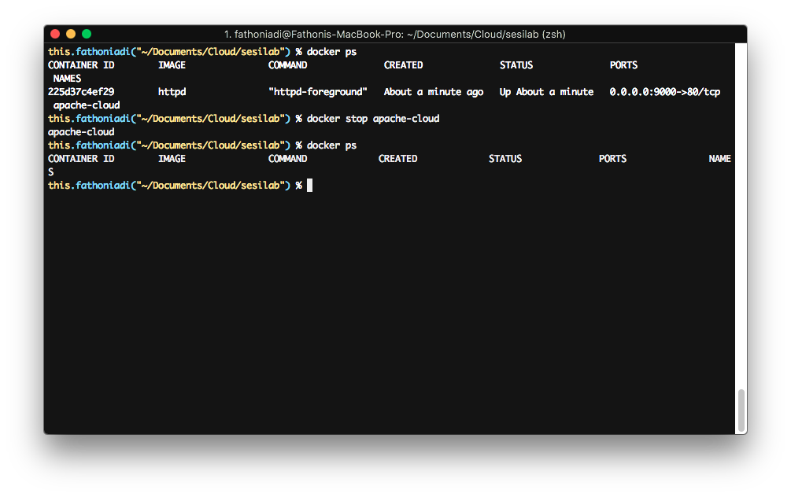

    5.1.2. Pada saat menjalankan `docker ps`, container docker yang ditampilkan __hanya service yang sedang berjalan__. Untuk mengetahui semua service docker jalankan perintah

    `docker ps -a`

    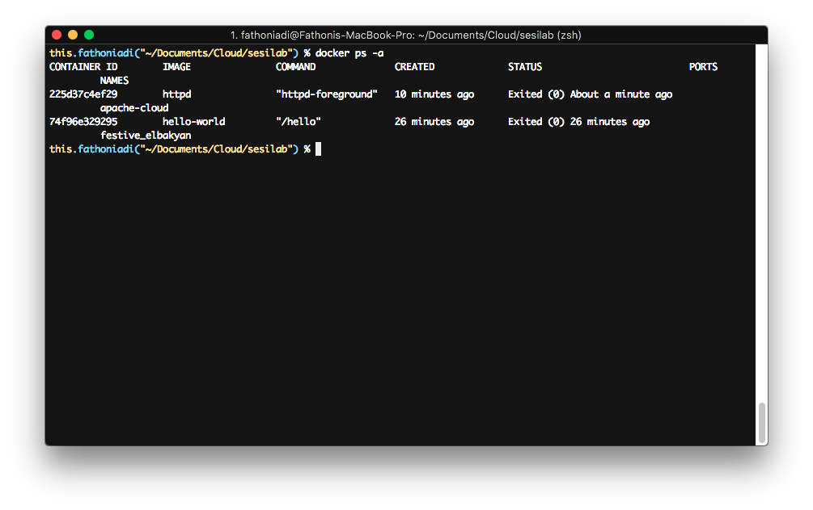

6. Untuk masuk ke container docker (Linux/Mac OS Only), nyalakan kembali container docker apache-cloud, kemudian jalankan

        docker exec -ti apache-cloud /bin/bash

    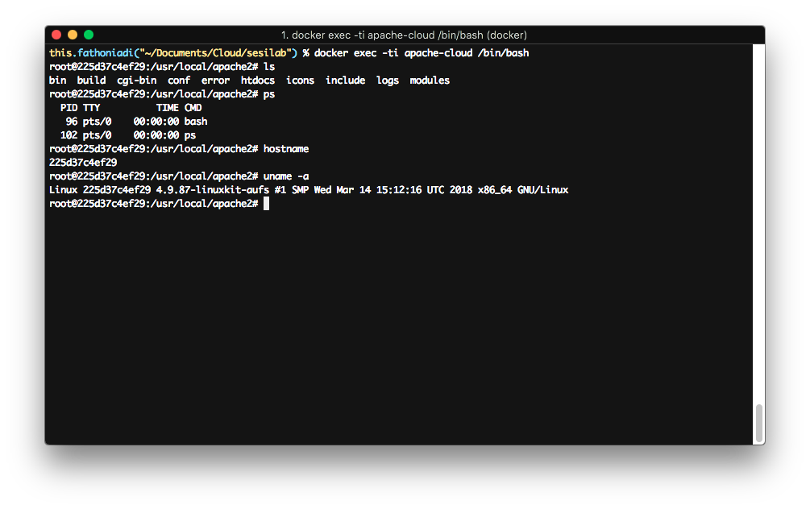

#### C.3. Docker Volume
Docker tidak menyimpan state atau data apapun di dalam kontainer. Sehingga jika kontainer mati kemudian dinyalakan lagi maka state akan kembali seperti semula. Semua perubahan tidak tersimpan, berbeda dengan virtual mesin yang menyimpan data dan state. Untuk mengatasi hal tersebut, docker memiliki fungsi volume untuk menyimpan perubahan data pada komputer hostnya. Sehingga ketika kontainer mati atau dihapus, data tetap tersimpan di komputer host dan dapat digunakan kembali oleh kontainer yang sama atau berbeda. Untuk mengaktifkan eksternal volume ikuti langkah-langkah berikut:

1. Matikan dan hapus kotnainer yang telah kita buat sebelumnya.

        docker stop apache-cloud
        docker rm apache-cloud
2. Buat folder baru bernama src dan tambahkan file __index.html__

        mkdir src
        echo "Hello Cloud" > src/index.html

3. Jalankan container.

        docker run --name apache-cloud -v "$PWD"/src:/usr/local/apache2/htdocs/ -p 9000:80 -d httpd

    Keterangan:
    - Argument -v untuk menambahkan docker volume. 
    - perintah __"$PWD"/src:/usr/local/apache2/htdocs/__, akan menghubungkan folder src ke folder htdocs pada kontainer. Perintah __"$PWD"__ digunakan untuk mendapatkan posisi folder saat ini.

4. Buka browser dan akses __http://localhost:9000__

    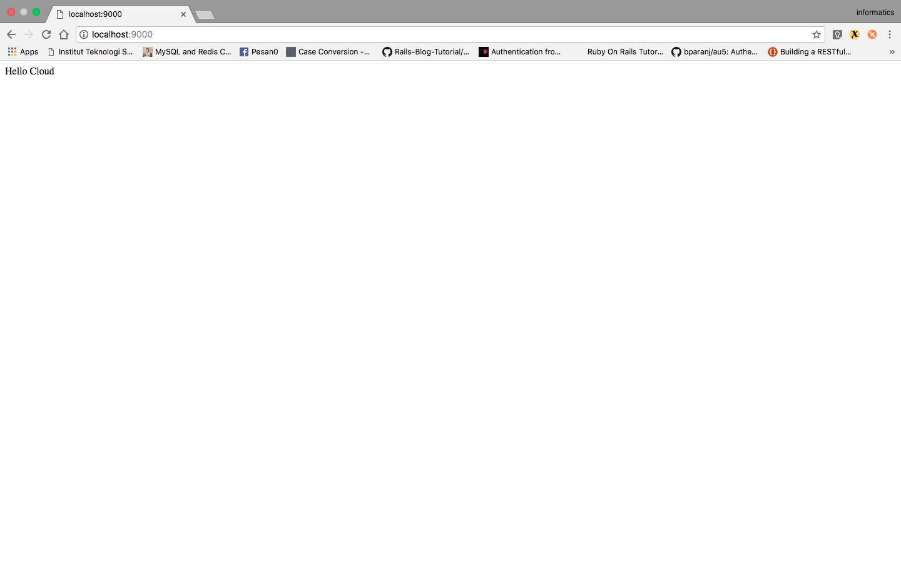

### D. Dockerfile
Dockerfile adalah file yang berisi perintah-perintah yang digunakan untuk membuat image container sendiri.

Bagaimana caranya?

1. Buat folder www

        mkdir www
2. Buat file index.php di dalam folder www

        echo "<?php phpinfo(); ?>" > www/index.php

3. Buat Dockerfile dengan isi sebagai berikut:

        FROM ubuntu:16.04

        RUN apt-get update && apt-get install -y apache2 php7.0 php7.0-fpm libapache2-mod-php && apt-get clean && rm -rf /var/lib/apt/lists/*

        COPY www/index.php /var/www/html

        WORKDIR /var/www/html
        RUN rm index.html

        WORKDIR /

        CMD ["apachectl", "-D", "FOREGROUND"]

        EXPOSE 80

    Keterangan:

    - __FROM__ : Base image container yang tersedia
    - __RUN__ : Untuk menjalankan perintah __saat pembuatan image container__
    - __COPY__ : Untuk mengcopy file ke dalam image container
    - __WORKDIR__ : Untuk pindah directory saat pembuatan image container
    - __CMD__ : Untuk menjalankan perintah __saat container dinyalakan__
    - __EXPOSE__ : Untuk mendefinisikan port yang akan digunakan sebagai port forwarding
    - Syntax lebih lanjut cek [Klik Disini](https://docs.docker.com/engine/reference/builder/)
4. Buat image dengan perintah

        docker build -t ubuntu-komputasiawan-images ./

5. Buat container baru dengan perintah

        docker run --name ubuntu-cloud -p 9001:80 -d ubuntu-komputasiawan-images

6. Cek pada browser

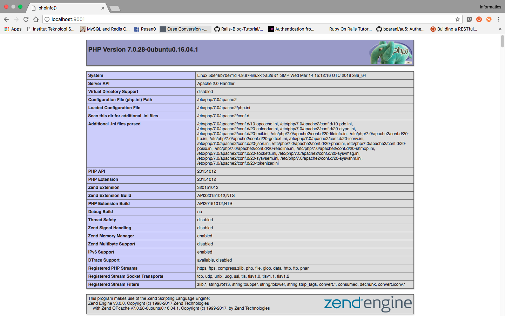

### D. Docker Compose
Docker Compose adalah file untuk menjalankan container lebih dari satu.

#### D.1 Basic Docker Compose
1. Buat file dengan nama __docker-compose.yml__ dengan isi sebagai berikut

        version: '3.3'

        services:
        db:
            image: mysql:5.7
            volumes:
                - dbdata:/var/lib/mysql
            restart: always
            environment:
                MYSQL_ROOT_PASSWORD: somewordpress
                MYSQL_DATABASE: wordpress
                MYSQL_USER: wordpress
                MYSQL_PASSWORD: wordpress

        wordpress:
            depends_on:
                - db
            image: wordpress:latest
            ports:
                - "8000:80"
            restart: always
            environment:
                WORDPRESS_DB_HOST: db:3306
                WORDPRESS_DB_USER: wordpress
                WORDPRESS_DB_PASSWORD: wordpress
        volumes:
            dbdata:

    Keterangan: 

    - __wordpress, db__ : adalah nama service
    - __images__ : digunakan untuk deklarasi nama image container seperti -d pada docker cli
    - __ports__ : untuk deklarasi port forwording seperti -p
    - __restart__ : untuk flag restart apabila service gagal
    = __environment__ : untuk deklarasi variable environment
    - __volumes__ : untuk deklarasi volume
    - __depends_on__ : untuk deklarasi hubungan dependensi antar container
2. Untuk menjalankan docker compose dengan perintah berikut

        docker-compose up -d
    
    Keterangan:
    - -d untuk berjalan pada background

#### D.2 Build Dockerfile dengan Docker Compose
1. Buat file docker-compose.yml pada folder tempat Dockerfile yang dibuat pada bagian sebelumnya dengan isi.

        version: '3.3'

        services:
            ubuntu-cloud:
                build:
                    context: ./
                ports:
                    - "9001:80"
                volumes:
                    - ./www:/var/www/html
    Keterangan:

    - context: menunjukkan tempat Dockerfile disimpan

2. Untuk menjalankan Docker Compose dan membuat Docker Image dengan perintah

        docker-compose up -d --build

#### D.3 Perintah pada Docker Compose yang perlu diketahui
- Untuk membuat container dengan Docker Compose : `docker-up up -d`
- Untuk menjalankan Docker Compose : `docker-up start`
- Untuk menhentikan Docker Compose : `docker-up stop`
- Untuk menghapus Docker Compose : `docker-up rm`

### E. Soal

#### [Peraturan]
1. Laporan harus berupa Markdown.
2. Tata cara pengerjaan silahkan lihat [Klik Disini](https://github.com/dzakybd/PKSJ_Tugas) sebagai pedoman bentuk sitematis laporan.
3. Ikui apa yang diminta oleh soal, dan tidak diperbolehkan menginstall atau mensetup config melalui perintah docker exec -ti [ID Container] /bin/bash

Nana adalah mahasiswa semester 6 dan sekarang sedang mengambil matakuliah komputasi awan. Saat mengambil matakuliah komputasi awan dia mendapatkan materi sesilab tentang Docker. Suatu hari Nana ingin membuat sistem reservasi lab menggunakan Python Flask. Dia dibantu temannya, Putra awalnya membuat web terlebih dahulu. Web dapat di download [disini](https://cloud.fathoniadi.my.id/reservasi.zip).

Setelah membuat web, Putra dan Nana membuat Custom Image Container menggunakan Dockerfile. Mereka membuat image container menggunakan base container ubuntu:16.04 kemudian menginstall aplikasi flask dan pendukungnya agar website dapat berjalan [1].

Setelah membuat custom image container, mereka kemudian membuat file __docker-compose.yml__. Dari custom image yang dibuat sebelumnya mereka membuat 3 node yaitu worker1, worker2, dan worker3 [2].

Setelah mempersiapkan worker, mereka kemudian menyiapkan nginx untuk loadbalancing ketiga worker tersebut (diperbolehkan menggunakan images container yang sudah jadi dan ada di Docker Hub) [3].

Karena web mereka membutuhkan mysql sebagai database, terakhir mereka membuat container mysql (diperbolehkan menggunakan images container yang sudah jadi dan ada di Docker Hub)  yang dapat diakses oleh ke-3 worker yang berisi web mereka tadi dengan environment:

    username : userawan
    password : buayakecil
    nama database : reservasi

Selain setup environmet mysql, mereka juga mengimport dump database web mereka menggunakan Docker Compose dan tak lupa membuat volume agar storage mysql menjadi persisten[4].

### F. Referensi
1. Modul Komputasi Awan 2017 oleh Thiar Hasbiya S.Kom, M.Kom
2. [Docker official website](https://docker.com)
